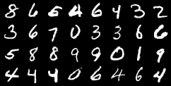
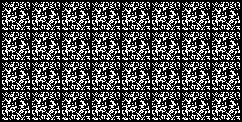
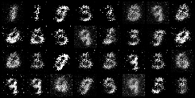
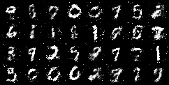

# GANs-Pytorch-implementation
使用Pytorch实现简单的生成对抗网络 

# 说明

① 选择main文件运行，数据集使用MINIST手写体数据集，运行数据保存在log文件夹。  
② 训练完成之后在pycharm打开终端输入"tensorboard --logdir=log"即可在浏览器查看保存的数据  

# 实验结果

真实图像  
  

step1生成图像   
  

step8生成图像  
  

step20生成图像  

